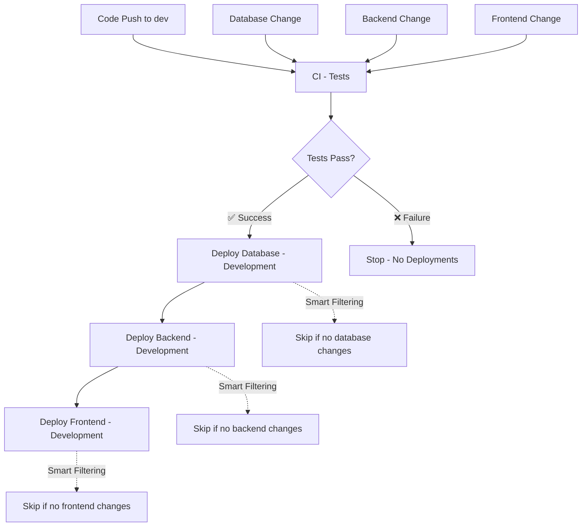

# GitHub Actions Workflows

## Overview

The Chore Garden project implements a modern CI/CD pipeline using GitHub Actions with a component-based deployment strategy. The system is designed around the principle of deploying only what changes, optimizing for speed, efficiency, and reliability.

**Core Philosophy:**
- **Component isolation**: Database, backend, and frontend deployments are separate workflows
- **Conditional triggering**: Path-based and change-based, workflows only run when relevant code changes (e.g. frontend deployment)
- **Dependency sequencing**: Database → Backend → Frontend deployment order
- **Secure authentication**: GitHub OIDC eliminates long-lived credentials
- **Environment separation**: Development has automated deployment, production requires manual approval

**Key Benefits:**
- **Faster feedback**: Only affected components are built and deployed
- **Reduced cost**: Unnecessary workflow runs are eliminated  
- **Clear ownership**: Each workflow has a single responsibility
- **Safer deployments**: Isolated failures don't affect other components
- **Better observability**: Component-specific logs and metrics

The system uses GitHub OIDC for secure, temporary AWS authentication and follows infrastructure-as-code principles for consistency across environments.

## Workflows

### `ci-tests.yml` - CI Tests

Runs all tests (backend and frontend) for quality assurance.

**Triggers:**
- Pull Requests to `dev` or `main`
- Pushes to `dev` or `main`
- Manual workflow dispatch 

To manually run tests:
- GitHub UI: Go to Actions → "CI - Tests" → "Run workflow" → Select branch → "Run workflow"
- GitHub CLI: gh workflow run "CI - Tests" --ref branch-name

**Purpose:** Validate code quality before any deployment

### `deploy-database-dev.yml` - Database Development Deployment

Deploys database changes (migrations, schema updates) to the development environment.

**Triggers:**
- Pushes to `dev` branch with changes in `database/**`
- Automatically after successful test completion (workflow_run from `CI - Tests`)
  - **Smart Filtering**: Only deploys if database changes are detected
- Manual workflow dispatch

**Purpose:** Apply database schema changes and migrations to development environment

### `deploy-backend-dev.yml` - Backend Development Deployment

Deploys backend application to the development environment.

**Triggers:**
- Pushes to `dev` branch with changes in `backend/**`
- Automatically after successful database deployment (workflow_run from `Deploy Database - Development`)
- Automatically after successful test completion (workflow_run from `CI - Tests`)
  - **Smart Filtering**: Only deploys if backend changes are detected
- Manual workflow dispatch

**Purpose:** Deploy backend application container to ECS development environment

### `deploy-frontend-dev.yml` - Frontend Development Deployment

Deploys frontend application to the development environment.

**Triggers:**
- Pushes to `dev` branch with changes in `frontend/**`
- Automatically after successful backend deployment (workflow_run from `Deploy Backend - Development`)
- Automatically after successful test completion (workflow_run from `CI - Tests`)
  - **Smart Filtering**: Only deploys if frontend changes are detected
- Manual workflow dispatch

**Purpose:** Build and deploy React frontend to S3 development bucket with updated configuration

### `deploy-prod.yml` - Production Deployment

Deploys to the production environment (manual trigger only).

**Triggers:**
- Manual workflow dispatch only

**Purpose:** Controlled production deployment

## Development Workflow

The development workflow follows a **test-first, component-based deployment strategy** that ensures code quality before any deployments and only deploys components that have changed:

### **Quality Gate: Tests Must Pass First**

All deployments are gated behind successful test completion:

1. **Create feature branch** from `dev`
2. **Develop and commit** changes in specific component directories
3. **Create PR** to `dev` branch
   - ✅ Triggers: `ci-tests.yml` runs tests
   - 🚫 No deployments until tests pass
4. **Merge PR** into `dev`
   - ✅ **Step 1**: `ci-tests.yml` runs tests (frontend + backend with database)
   - ✅ **Step 2**: If tests pass, component-specific deployments run based on changed paths
   - 🚫 **Step 2**: If tests fail, no deployments run

### **Smart Deployment Flow (After Tests Pass)**

**Database Changes (`database/**`):**
```
Tests Pass ✅ → Database Deploy → Backend Check → Frontend Check
                      ↓              ↓             ↓
                   Migrations     Skip if no    Skip if no
                    Applied       backend       frontend
                                 changes       changes
```

**Backend Changes (`backend/**`):**
```
Tests Pass ✅ → Database Check → Backend Deploy → Frontend Check
                      ↓              ↓             ↓
                  Skip if no      Container     Skip if no
                  database        Updated       frontend
                  changes                       changes
```

**Frontend Changes (`frontend/**`):**
```
Tests Pass ✅ → Database Check → Backend Check → Frontend Deploy
                      ↓              ↓             ↓
                  Skip if no      Skip if no     S3 Updated
                  database        backend        + Config
                  changes         changes        Generated
```

**Multi-Component Changes:**
```
Tests Pass ✅ → Database Deploy → Backend Deploy → Frontend Deploy
                (if changed)      (if changed)     (if changed)
```

### **Key Benefits of Test-First Architecture**

- 🛡️ **Safety**: No broken code reaches any environment
- ⚡ **Efficiency**: Only changed components deploy
- 🔄 **Proper Sequencing**: Database → Backend → Frontend dependency order maintained
- 📊 **Clear Feedback**: Immediate test results before any infrastructure changes
- 💰 **Cost Optimization**: Failed tests prevent expensive deployments
- 🔍 **Better Debugging**: Component-specific deployment logs

## Production Deployment

Production deployments are **manual only** for safety and control.

**Via GitHub UI:**
1. Go to repository → Actions tab
2. Select "Deploy - Production" workflow
3. Click "Run workflow" button
4. Select branch (typically `main` for production)
5. Click "Run workflow"

**Via GitHub CLI:**
```bash
gh workflow run "Deploy - Production" --ref main
```

**What runs:**
- All production deployment jobs run (frontend, backend, database)
- Note: Tests are not automatically run as part of production deployment
- Ensure recent tests have passed before triggering production deployment

## Infrastructure

For now infrastructure updates are NOT handled via the ci/cd pipeline. That may change in the future, but for now it has too much potential to create / spin up something expensive. Infrastructure changes are handled through manually run `terraform apply` from the local machine.

### future options for infrastructure

- maybe create an infrastructure-specific pipeline (at least for production)
- maybe bake it into the production pipelines
- look into git ops; others have certainly faced this challenge before and found acceptable solutions

## Jobs Overview

### CI Tests (`ci-tests.yml`)
| Job | Purpose |
|-----|---------|
| `test` | Run backend and frontend tests with temporary PostgreSQL |

### Development Deployment (Component-Based)
| Workflow | Purpose | Triggers | Dependencies | Status |
|----------|---------|----------|--------------|--------|
| `deploy-database-dev.yml` | Apply database migrations to dev | `database/**` changes, after tests pass, manual | Tests ✅ | 🚧 **Placeholder** |
| `deploy-backend-dev.yml` | Deploy backend to dev ECS | `backend/**` changes, after database or tests, manual | Tests ✅, Database (optional) | 🚧 **Placeholder** |
| `deploy-frontend-dev.yml` | Deploy frontend to dev S3 | `frontend/**` changes, after backend or tests, manual | Tests ✅, Backend (optional) | ✅ **Active** |

### Production Deployment (`deploy-prod.yml`)
| Job | Purpose | Status |
|-----|---------|--------|
| `deploy-frontend-prod` | Deploy frontend to prod S3 bucket | 🚧 **Placeholder** |
| `deploy-backend-prod` | Deploy backend to prod ECS | 🚧 **Placeholder** |
| `deploy-db-prod` | Run database migrations on prod | 🚧 **Placeholder** |

#### Authentication

**GitHub OIDC (OpenID Connect)**

The workflows use GitHub OIDC for secure, temporary authentication with AWS:

- **No long-lived credentials**: Temporary tokens are issued for each workflow run
- **Branch restrictions**: Only specified branches can assume the deployment roles
- **Fine-grained permissions**: Each environment has its own IAM role with minimal required permissions
- **Audit trail**: All authentication attempts are logged in AWS CloudTrail

**Setup Requirements:**
1. Deploy the `iam_github_oidc` Terraform module (included in dev environment)
2. Set the `AWS_ACCOUNT_ID_DEV` and `AWS_ACCOUNT_ID_PROD` repository variables
3. Ensure your repository and branch names match the OIDC trust policy

For detailed setup instructions, see: `infrastructure/modules/iam_github_oidc/README.md`

#### Required Secrets and Variables

The workflows require these secrets and variables to be configured in repository settings:

**Repository Variables (Settings → Secrets and variables → Actions → Variables):**
- `AWS_ACCOUNT_ID_DEV` - Your choregarden-dev AWS account ID (12 digits, used for dev deployments)
- `AWS_ACCOUNT_ID_PROD` - Your choregarden-prod AWS account ID (12 digits, used for prod deployments)

**Testing (`ci-tests.yml`):**
- `POSTGRES_USER` - Test database username (secret)
- `POSTGRES_PASSWORD` - Test database password (secret)
- `POSTGRES_DB` - Test database name (secret)

**Development Deployments (`deploy-dev.yml`):**
- Uses GitHub OIDC to assume IAM role: `github-actions-dev`
- No long-lived AWS credentials required

**Production Deployments (`deploy-prod.yml`):** (TBD)
- Production OIDC role will be: `github-actions-prod` (when implemented)

#### Workflow Dependencies

**Test-First Architecture:**
All development deployments are gated behind successful test completion:



**Dependency Rules:**
- ✅ **Tests** must pass before any deployment
- 🔄 **Database** → **Backend** → **Frontend** sequence (when relevant)
- 🧠 **Smart filtering** prevents unnecessary deployments
- 🚫 **Failed tests** block all deployments
- ✋ **Manual triggers** bypass test requirements (for debugging)

**Trigger Priority:**
1. **Direct Path Changes**: `frontend/**` → Direct frontend deployment (after tests)
2. **Dependency Chain**: Database changes → All downstream components check for changes
3. **Manual Override**: `workflow_dispatch` always runs (regardless of changes)

#### Current Implementation Status

| Component | Dev Deployment | Prod Deployment |
|-----------|----------------|-----------------|
| Database | 🚧 **Placeholder** - Migration execution via Lambda | 🚧 **Placeholder** |
| Backend | 🚧 **Placeholder** - ECS container deployment | 🚧 **Placeholder** |
| Frontend | ✅ **Active** - S3 sync + config generation | 🚧 **Placeholder** |

**Component Workflow Status:**
- **Database workflow**: Created with path filtering (`database/**`)
- **Backend workflow**: Created with path filtering (`backend/**`) + database dependency
- **Frontend workflow**: Active with path filtering (`frontend/**`) + backend dependency
- **Legacy workflow**: `deploy-dev-legacy.yml` preserved for reference

#### Deployment Architecture

**Development Environment:**
- Frontend: S3 bucket `choregarden-frontend-dev`
- Backend: ECS service (TBD)
- Database: RDS instance with migrations via ops-lambda (TBD)

**Production Environment:**
- Frontend: TBD
- Backend: TBD  
- Database: TBD

#### Troubleshooting

**Common Issues:**

1. **Tests failing**: Check `ci-tests.yml` job logs
2. **Dev deployment not triggering**: Ensure tests passed successfully on dev branch
3. **AWS permissions**: Verify secrets are correctly configured
4. **Terraform errors**: Check AWS credentials and Terraform state
5. **Manual prod trigger not working**: Ensure you have appropriate repository permissions

**Debugging Steps:**
1. Check the Actions tab for detailed logs of each workflow
2. Verify all required secrets are configured
3. Ensure AWS credentials have necessary permissions
4. For dev deployments, confirm the tests workflow completed successfully first
5. Check for any infrastructure changes that might affect deployment

#### Benefits of This Structure

- **Component isolation**: Each deployment workflow handles a single responsibility
- **Efficient resource usage**: Only changed components trigger deployments
- **Clear dependency management**: Database → Backend → Frontend sequence is enforced
- **Faster feedback loops**: Frontend-only changes don't rebuild backend/database
- **Independent scaling**: Each component can evolve its deployment strategy separately
- **Better debugging**: Component-specific logs make troubleshooting easier
- **Cost optimization**: Reduced compute time and AWS resource usage
- **Safe**: Production deployments are completely separate and manual-only
- **Secure**: Uses GitHub OIDC for AWS authentication (no long-lived credentials)

#### Future Enhancements

- Implement backend deployment automation (ECS container updates)
- Implement database migration automation (ops-lambda integration)
- Add production environment configuration with approval gates
- Create reusable frontend config action for cross-environment consistency
- Add deployment notifications (Slack, email)
- Add rollback capabilities for each component
- Add staging environment workflows
- Implement blue/green deployments for zero-downtime updates
